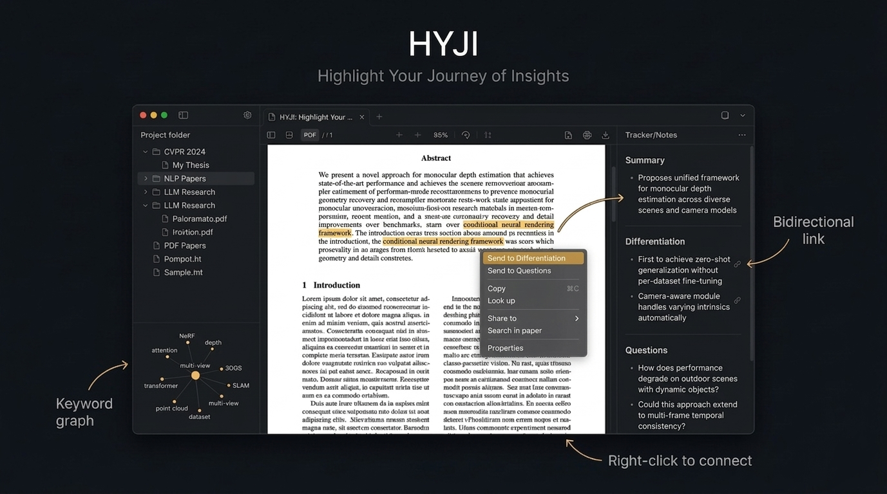

<div align="center">

# HYJI

### Highlight Your Journey of Insights

**A free, open-source desktop research hub for reading, annotating, and tracking academic papers.**



[](./LICENSE)
[](https://github.com/inyoungoh-cde/hyji/releases)
[](https://tauri.app)
[](https://github.com/inyoungoh-cde/hyji/releases)

</div>

---

## What is HYJI?

HYJI (pronounced *hai-jee*) is a desktop app built for researchers who spend serious time in PDFs. It combines a PDF reader, highlight/annotation tool, structured note-taking panel, and a project management layer — all in one window, all stored locally.

No cloud. No subscriptions. No AI fluff. Just you and your papers.

---

## Why HYJI?

Other tools let you manage papers. HYJI lets you **think through** them.

- **Right-click → Send to Differentiation** — Select a sentence in the PDF, right-click, and choose exactly where it goes: Summary, Differentiation, or Questions. The text becomes a linked bullet in your structured notes. No other tool lets you classify annotations into research categories at the moment of reading.

- **Bidirectional anchor links** — Every linked bullet has a 🔗 icon. Click it, and the PDF scrolls to the exact sentence you highlighted — not just the page, the sentence. "Where did I read that?" is no longer a question.

- **Built-in research framework** — Every paper gets three sections: Summary (what it does), Differentiation (what makes it different), Questions (what remains open). As your library grows, you can instantly compare any two papers without re-reading either.

- **Keyword graph, zero setup** — Import papers and their keywords are auto-extracted from PDF metadata. A force-directed graph in the sidebar shows how your papers connect. Click a node to filter. No manual tagging required.

---

## Features

- **PDF Viewer** — Continuous scroll, zoom, text search, clickable hyperlinks and internal reference links, Focus Mode (Ctrl+L) for distraction-free reading

- **Highlights & Memos** — 5 highlight colors, margin memos, save highlights to PDF as standard annotations

- **Smart Paste** — Paste BibTeX, citation string, arXiv ID, or RIS — HYJI auto-detects the format and parses all fields. Supports @article, @book, @phdthesis, and more.

- **Export dialog** — Choose output format (LaTeX / Word / CSV / clipboard), citation style (IEEE / ACS / Nature / APA / MLA), journal name format (full / abbreviated), and starting number. Live preview included.

- **Project Tree** — Organize papers into collapsible folders, drag to reorder, inline rename with F2

- **Keyword Graph** — D3 force-directed graph of keyword co-occurrence; click a node to filter papers

- **Auto-backup** — Configure backup folder and interval in Preferences; only backs up when changes are detected

- **Dashboard** — Notion-style home screen with recent papers, reading stats, and quick actions

- **100% Local** — SQLite database on your disk. No account, no cloud, no tracking. Works offline forever.

---

## Download

> **Windows only in v1.0. macOS / Linux planned.**

**[⬇ Download latest installer (.msi)](https://github.com/inyoungoh-cde/hyji/releases/latest)**

1. Download `HYJI_x.x.x_x64_en-US.msi` from the Releases page
2. Double-click → Next → Next → Install → Finish
3. Launch HYJI from the Start menu

HYJI checks for updates automatically on launch.

---

## Quick Start

1. **Create a project** — Click `+` in the sidebar header or `File → New Project`
2. **Add a paper** — Drag a PDF onto the window, or `File → Import PDF`
3. **Paste metadata** — Use `Ctrl+N` (Smart Paste) to paste BibTeX or a citation string
4. **Highlight** — Select text in the PDF → right-click → choose a highlight color
5. **Take notes** — Select text → right-click → `Send to Differentiation` or `Send to Questions`; click 🔗 on any linked bullet to jump back to the source

**Keyboard shortcuts:** `Ctrl+/` shows the full list in-app.

---

## Tech Stack

| Layer | Technology |
|-------|-----------|
| Framework | Tauri v2 (Rust + WebView2) |
| Frontend | React 18 + TypeScript |
| Styling | Tailwind CSS |
| PDF rendering | pdf.js (Mozilla) |
| Database | SQLite via tauri-plugin-sql |
| State | Zustand |
| Build | Vite |
| Graph | D3.js (force layout) |
| PDF export | pdf-lib |

---

## Build from Source

**Prerequisites:**
- [Node.js](https://nodejs.org/) 18+
- [Rust](https://rustup.rs/) (stable toolchain)
- [Tauri CLI prerequisites for Windows](https://v2.tauri.app/start/prerequisites/) (WebView2, Visual Studio Build Tools)

```bash
# Clone the repo
git clone https://github.com/inyoungoh-cde/hyji.git
cd hyji

# Install JS dependencies
npm install

# Run in development mode
npm run tauri dev

# Build a release installer
npm run tauri build
```

The built installer will be at `src-tauri/target/release/bundle/msi/`.

---

## Known Issues & Tips

### Keyword graph shows word fragments (e.g. `corre`, `turefinetuning`)

**Cause:** Some PDFs encode the document title in the text layer without word spaces, or with line-break hyphens (e.g. `"CORRE- SPONDENCE…"`). HYJI extracts the title from this raw text, so the stored title can look like `MULTIVIEWEQUIVARIANCEIMPROVES3D CORRE- SPONDENCE…`. When keyword extraction falls back to the title, it produces word-fragment keywords.

**Fix:**
1. Open the paper in HYJI and edit the **Title** field in the Tracker panel (bottom, expand Metadata) to the correct title.
2. Run **Tools → Regenerate Keywords**.

**Prevention:** Use **Smart Paste** (`Ctrl+N`) to paste a BibTeX entry or citation string when importing a paper — this gives HYJI accurate metadata from the start and avoids relying on PDF text extraction.

> See [#known-issues](https://github.com/inyoungoh-cde/hyji/issues?q=label%3Aknown-issue) on GitHub for the full list.

---

## Contributing

Issues and pull requests are welcome.

- **Bug reports:** Open an issue with steps to reproduce
- **Feature requests:** Open an issue describing the use case
- **Pull requests:** Fork the repo, create a branch, submit a PR against `main`

Please keep PRs focused — one feature or fix per PR.

---

## Changelog

### v1.0.0 (Apr 2026)
- Official release — all features from v0.1.x are now production-ready
- New app icon with improved visibility at small sizes
- PDF internal reference click with return-to-position and extended flash animation
- Updated README with "Why HYJI?" section highlighting key differentiators

### v0.1.7 (Apr 2026)
- New Export dialog: pick LaTeX `.bib` / Word `.txt` / CSV / Clipboard, citation style (IEEE / ACS / Nature / APA / MLA), starting number, and journal-name abbreviation format — with live preview
- RIS import (drag a `.ris` file or paste RIS text into Smart Paste)
- Reference types: article / conference / book / book chapter / thesis / misc with publisher, edition, chapter, pages, DOI fields; type-aware BibTeX export
- Venue/journal abbreviation mapping expanded to 247 entries (ISO 4 / CASSI)
- Focus Mode (Ctrl+L) — hides sidebar and tracker, fits PDF width; Esc or Ctrl+L exits
- Auto-backup of the SQLite database with configurable folder, interval, "only on change", and keep-last-N rotation; configured in File → Preferences…

### v0.1.6 (Apr 2026)
- PDF file association — set HYJI as the default `.pdf` handler in Windows and double-click any PDF to launch HYJI; the file is auto-imported as an unassigned paper, ready to read and annotate
- Visible scrollbars — bumped from 6px/grey to 8px/white (40 %) across sidebar, tracker, PDF viewer, and popup menus
- Right-click "Move to" menu no longer gets cut off when there are many projects: scrolls when too tall, flips upward when near the window bottom

### v0.1.5 (Apr 2026)
- Fixed keyword graph shaking while typing in note fields (D3 simulation was restarting on every keystroke due to unstable memo dependencies)

### v0.1.4 (Apr 2026)
- Auto context menu after text drag-select — no right-click needed
- Menu clamped to viewport, selection cleared on dismiss
- Garbled keyword extraction fixed: hyphenated PDF titles and concatenated text no longer produce word-fragment keywords

### v0.1.3 (Apr 2026)
- Fixed XMP keyword extraction — keywords stored only in XMP metadata (Oxford Academic, JCDE journals) now correctly extracted; root cause was pdfjs detaching the ArrayBuffer before the XMP scan could run

### v0.1.2 (Apr 2026)
- Fixed keyword duplication on paper import (race condition between two concurrent keyword-extraction effects)
- Fixed keyword graph nodes clumping at center after Regenerate Keywords
- Added Import PDF icon button to Projects header for one-click access

### v0.1.1 (Apr 2026)
- Improved Questions section color — more vivid violet for better readability
- Added text size options (Default / Large / X-Large) in View menu
- Converted all font sizes to rem units for consistent scaling
- Connected About HYJI and Help menu GitHub links to repository

### v0.1.0 (Apr 2026)
- Initial release — PDF viewer, highlights, bidirectional notes, Smart Paste, keyword graph, dashboard, BibTeX export

[See full changelog →](./CHANGELOG.md)

---

## License

MIT License © 2026 HJ & IY — see [LICENSE](./LICENSE) for full text.

---

## Credits

Made by **HJ & IY**
