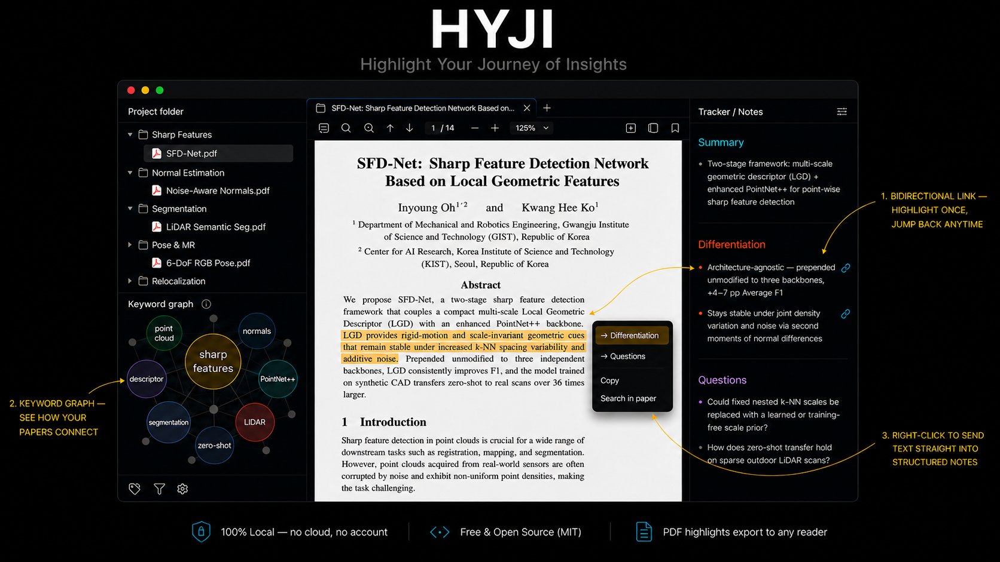

<div align="center">

# HYJI

### Highlight Your Journey of Insights

**A free, open-source desktop research hub for reading, annotating, and tracking academic papers.**



[](./LICENSE)
[](https://github.com/inyoungoh-cde/hyji/releases)
[](https://tauri.app)
[](https://github.com/inyoungoh-cde/hyji/releases)

</div>

---

## What is HYJI?

HYJI (pronounced *hai-jee*) is a desktop app built for researchers who spend serious time in PDFs. It combines a PDF reader (rendered by PDFium, the engine inside Chrome and Edge), a highlight/annotation tool, a structured note-taking panel, and a project management layer — all in one window, all stored locally.

No cloud. No subscriptions. No AI fluff. Just you and your papers.

---

## Why HYJI?

Other tools let you manage papers. HYJI lets you **think through** them.

- **Right-click → Send to Differentiation** — Select a sentence in the PDF, right-click, and choose exactly where it goes: Summary, Differentiation, or Questions. The text becomes a linked bullet in your structured notes. No other tool lets you classify annotations into research categories at the moment of reading.

- **Bidirectional anchor links** — Every linked bullet has a 🔗 icon. Click it, and the PDF scrolls to the exact sentence you highlighted — not just the page, the sentence. "Where did I read that?" is no longer a question.

- **Built-in research framework** — Every paper gets three sections: Summary (what it does), Differentiation (what makes it different), Questions (what remains open). As your library grows, you can instantly compare any two papers without re-reading either.

- **Keyword graph, zero setup** — Import papers and their keywords are auto-extracted from PDF metadata. A force-directed graph in the sidebar shows how your papers connect. Click a node to filter. No manual tagging required.

- **Reads like a real PDF viewer** — Pages are rasterized by PDFium with hinted, pixel-exact text, so a paper is as sharp in Focus Mode on a 100 %-scale portrait monitor as it is in Edge or Acrobat. Dark mode inverts the page but keeps figures in their true colors.

- **One-glance triage** — Every paper carries a level (★ Noted · ★★ Relevant · ★★★ Core) and an optional ⚑ Revisit flag. The same stars and flag appear on sidebar rows, filter chips, the viewer toolbar and the dashboard, so you never need a legend — and a swipe on a row sets the flag.

---

## Features

### Reading

- **PDF viewer** — Continuous scroll, zoom (Ctrl+wheel, fit width), clickable hyperlinks and internal reference links with a "Back to reading" button, print (Ctrl+P), Focus Mode (Ctrl+L) for distraction-free reading. Korean/Japanese/Chinese PDFs render correctly (bundled CJK fonts).
- **Large files** — Proceedings volumes and scanned books (hundreds of MB) open in under a second: files over 20 MB are streamed to the viewer by ranges on demand instead of being read whole.
- **Hinted, pixel-exact text on every monitor** — Pages are rasterized by PDFium (the engine inside Chrome and Edge) and displayed 1:1 on device pixels, so stroke weight is uniform and Focus Mode on a 100 %-scale portrait display reads like Edge or Acrobat. Pages re-render when the window moves between displays with different scaling. Preferences → *PDF render engine* switches to the classic pdf.js renderer if a document ever needs it (the app also falls back automatically when the PDFium library is unavailable), and *PDF text rendering* adds optional stem darkening per engine (Off / Subtle / Standard / Strong — PDFium defaults to Off, the crispest).
- **PDF dark mode** (Ctrl+D) — Inverted night reading that keeps figures and photos in their true colors.
- **Multi-tab reading** — Several papers in browser-style tabs; each tab remembers its zoom and reading position, and open tabs are restored on the next launch. Double-clicking a PDF in Explorer opens it as a tab in the running app.
- **Print** (Ctrl+P) — High-resolution print with your highlights, underlines and memos burned in, rendered by the same engine as the screen.

### Annotating & note-taking

- **Highlights, underlines, strikeouts & memos** — Four colors each, margin memos, and an auto-appearing selection menu after you drag-select.
- **Send to Differentiation / Questions** — Selected text becomes a linked bullet in the tracker; the 🔗 icon jumps back to the exact sentence.
- **True two-way interop** — "Save annotations to PDF" writes standard annotations that Adobe Acrobat and other viewers display and edit; annotations made elsewhere are imported as editable HYJI annotations (Tools → Import Annotations from PDF).
- **Structured notes** — Summary / Differentiation / Questions bullet editors on top; collapsible metadata (type, authors, venue, DOI ↗, abstract, keywords) below.

### Organizing

- **Level & Revisit** — ★ / ★★ / ★★★ level plus a ⚑ Revisit flag per paper. Filter chips and sort by either; the dashboard counts them.
- **Project tree** — Collapsible nested folders with papers inline; drag a paper onto a folder, drag folders to reorder, F2 to rename. "Move to" in the context menu shows the real folder hierarchy.
- **Multi-select** — Ctrl+click, Shift+click ranges; right-click to move or delete the whole selection, Delete key, drag them all at once.
- **Swipe gestures** — Drag a paper row left to reveal Delete (all the way for the confirmation directly); drag right to toggle ⚑ Revisit.
- **Keyword graph** — D3 force-directed graph of keyword co-occurrence (auto-extracted from PDF metadata, editable per paper); click a node to filter, Ctrl+G for full screen.
- **Dashboard** — Home screen with recent papers, level/revisit counts, project shortcuts and quick actions.

### Metadata & export

- **Smart Paste** (Ctrl+N) — Paste BibTeX, a citation string, an arXiv ID or RIS; the format is auto-detected and every field parsed. Reference types (article / conference / book / chapter / thesis / misc) with publisher, edition, chapter, pages, DOI.
- **Fetch metadata** — One click looks the paper up on Crossref/arXiv from its DOI or arXiv ID (auto-detected in the PDF) with a confirm-before-overwrite diff. Strictly user-initiated — see [Privacy & Network Policy](#privacy--network-policy).
- **Export dialog** — LaTeX `.bib` / RIS / Word / CSV / clipboard; citation style (IEEE / ACS / Nature / APA / MLA); journal-name format (full / abbreviated, 247-entry ISO 4 / CASSI map); starting number; live preview. Raw pasted BibTeX is exported verbatim.
- **Full-text search** (Ctrl+Shift+F) — One overlay searches metadata, your notes *and* the text inside every PDF (Korean and English), with page-level hits that jump straight to the match; Ctrl+F scopes it to the open document.

### Workspace

- **Three resizable panels** — Sidebar · viewer · tracker with draggable splitters; View → Reset Panel Sizes (or double-click a splitter) restores the defaults. Startup layout preference: research hub or viewer-only.
- **Auto-backup** — Backup folder, interval, only-on-change and keep-last-N rotation in Preferences; a final backup on exit if anything changed.
- **100% local** — SQLite database on your disk. No account, no cloud, no tracking. Works offline forever — and an **Offline mode** switch in Preferences guarantees it.

---

## Privacy & Network Policy

HYJI is local-first and makes **no automatic network requests**. In full:

- **The only online feature is the metadata lookup** ("🌐 Fetch metadata"), and it runs only when you click it. It sends the paper's **DOI or arXiv ID — nothing else** — directly to `api.crossref.org` (Crossref, the non-profit DOI registry) or `export.arxiv.org` (arXiv, Cornell University) and reads back the public bibliographic record. These two domains are hard-coded as an allowlist in the Rust backend; the app cannot request any other host.
- **Your PDFs, notes, highlights, and library never leave your computer.** There is no account, no telemetry, no proxy server — requests go straight from your machine to the non-profit source.
- **Before the first lookup**, a one-time dialog explains exactly what will be sent; Cancel sends nothing.
- **Offline mode** (Tools → Preferences… → Network & privacy) disables online features entirely — with it on, HYJI makes zero network requests.

---

## Download

> **Windows only for now. macOS / Linux planned.**

**[⬇ Download latest installer (.msi)](https://github.com/inyoungoh-cde/hyji/releases/latest)**

1. Download `HYJI_x.x.x_x64_en-US.msi` (or the `-setup.exe`) from the Releases page
2. Double-click → Next → Next → Install → Finish
3. Launch HYJI from the Start menu — or set it as the default `.pdf` app and double-click any PDF

To update, download the newest installer from the Releases page and run it over the existing installation (your library, notes and settings are kept) — in line with the privacy policy above, HYJI does not phone home to check for updates.

---

## Quick Start

1. **Create a project** — Click the folder icon in the sidebar header or `File → New Project`
2. **Add a paper** — Drag a PDF onto the window, `File → Import PDF` (Ctrl+O), or double-click a PDF in Explorer
3. **Get the metadata** — `Ctrl+N` (Smart Paste) for BibTeX / citation / arXiv ID / RIS, or **Fetch metadata** in the tracker
4. **Highlight** — Drag-select text in the PDF → the selection menu appears → pick a highlight / underline / strikeout color
5. **Take notes** — In the same menu choose `Send to Differentiation` or `Send to Questions`; click 🔗 on any linked bullet to jump back to the source
6. **Triage** — Set the level (★ / ★★ / ★★★) in the tracker's Metadata section; swipe a sidebar row right to flag it ⚑ Revisit, left to delete it

### Level & Revisit at a glance

| Mark | Meaning |
|------|---------|
| ★ Noted | Skimmed or background reference (default) |
| ★★ Relevant | Directly related to your work, may cite |
| ★★★ Core | Must cite or compare against |
| ⚑ Revisit | Come back to this paper — a to-do flag independent of the level |

Color is only a secondary cue (gray → orange → red for the level, yellow for the flag); the star count and the flag glyph carry the meaning everywhere: sidebar rows, the PAPERS filter chips, the viewer toolbar, the dashboard and CSV export.

**Keyboard shortcuts:** `Ctrl+/` shows the full list in-app.

---

## Tech Stack

| Layer | Technology |
|-------|-----------|
| Framework | Tauri v2 (Rust + WebView2) |
| Frontend | React 18 + TypeScript |
| Styling | Tailwind CSS |
| PDF rasterization | PDFium (Chromium) via `pdfium-render`, pdf.js as fallback |
| PDF text layer / search | pdf.js (Mozilla) |
| Database | SQLite via tauri-plugin-sql |
| State | Zustand |
| Build | Vite |
| Graph | D3.js (force layout) |
| PDF export | pdf-lib |

---

## Build from Source

**Prerequisites:**
- [Node.js](https://nodejs.org/) 18+
- [Rust](https://rustup.rs/) (stable toolchain)
- [Tauri CLI prerequisites for Windows](https://v2.tauri.app/start/prerequisites/) (WebView2, Visual Studio Build Tools)

```bash
# Clone the repo
git clone https://github.com/inyoungoh-cde/hyji.git
cd hyji

# Install JS dependencies
npm install

# Fetch the PDFium library (once; bundled as an app resource)
npm run pdfium:fetch

# Run in development mode
npm run tauri dev

# Build a release installer
npm run tauri build
```

The built installer will be at `src-tauri/target/release/bundle/msi/`.

---

## Known Issues & Tips

### "Save annotations to PDF" over the original file shows highlights twice

**Cause:** "Save annotations to PDF" writes standard `/Highlight` / `/Underline` / `/StrikeOut` annotations into the file. If you save over the paper's own PDF instead of the suggested `…_annotated.pdf`, the viewer then draws the in-file annotations *and* HYJI's own overlay for the same text.

**Fix:** Save to a separate file (the default), or run **Tools → Import Annotations from PDF** on the overwritten file — it strips the in-file copies and keeps HYJI's editable ones.

### A document renders differently than in another viewer

Preferences → **PDF render engine** → *pdf.js (classic)* switches back to the pre-3.0 renderer for comparison; the setting applies immediately to open tabs. Please open an issue with the PDF if PDFium gets something wrong.

### Keyword graph shows word fragments (e.g. `corre`, `turefinetuning`)

**Cause:** Some PDFs encode the document title in the text layer without word spaces, or with line-break hyphens (e.g. `"CORRE- SPONDENCE…"`). HYJI extracts the title from this raw text, so the stored title can look like `MULTIVIEWEQUIVARIANCEIMPROVES3D CORRE- SPONDENCE…`. When keyword extraction falls back to the title, it produces word-fragment keywords.

**Fix:**
1. Open the paper in HYJI and edit the **Title** field in the Tracker panel (bottom, expand Metadata) to the correct title.
2. Run **Tools → Regenerate Keywords**.

**Prevention:** Use **Smart Paste** (`Ctrl+N`) to paste a BibTeX entry or citation string when importing a paper — this gives HYJI accurate metadata from the start and avoids relying on PDF text extraction.

> See [#known-issues](https://github.com/inyoungoh-cde/hyji/issues?q=label%3Aknown-issue) on GitHub for the full list.

---

## Contributing

Issues and pull requests are welcome.

- **Bug reports:** Open an issue with steps to reproduce
- **Feature requests:** Open an issue describing the use case
- **Pull requests:** Fork the repo, create a branch, submit a PR against `main`

Please keep PRs focused — one feature or fix per PR.

---

## Changelog

The three most recent releases; every release since 0.1 is in [CHANGELOG.md](./CHANGELOG.md) (releases before 2.0 were renumbered to a two-part scheme there — original git tags are unchanged).

### v3.1 (Sep 2026)
- Fixed 3.0 text looking soft: the page bitmap was resampled by a fraction of a pixel by the compositor; it is now displayed pixel-exact (portrait Focus Mode now matches the engine's own render 1:1)
- PDFium stem darkening defaults to Off (crispest, Edge-like); Subtle / Standard / Strong remain selectable

### v3.0 (Sep 2026)
- New page renderer: PDFium (Chrome/Edge's engine) replaces pdf.js rasterization — hinted, uniform strokes on standard-DPI monitors, which fixes the grainy/smeared text when reading in Focus Mode on a 100 %-scale portrait display; text selection, links, search and annotations stay on pdf.js
- Verified against pdf.js with a new render-integrity harness (`tools/render-verify/`): 110 pages across 12 real papers and synthetic rotation / CropBox / annotation / scanned / mixed-size fixtures — nothing pdf.js drew is missing (≤ 0.002 % ink), identical pixel sizes
- 260 MB proceedings volume: open ~15 ms, ~30 MB memory, ~6 ms per page
- Preferences → PDF render engine (PDFium / pdf.js classic) with automatic fallback; stem darkening remembered per engine (PDFium default Standard 0.35 ≈ Edge/Acrobat weight)

### v2.8 (Sep 2026)
- Status × Importance (3 × 3) replaced by one triage scale — ★ Noted / ★★ Relevant / ★★★ Core — plus a ⚑ Revisit flag; existing libraries are converted automatically (importance → level, "Revisit Needed" → flag)
- Same stars/flag everywhere: sidebar rows, PAPERS filter chips (★ ★★ ★★★ | ⚑) and sort, tracker level picker, viewer toolbar, dashboard counts, CSV columns
- Swipe a sidebar row right to toggle ⚑ Revisit (was: cycle status)

Older releases (2.7 → 0.1) are in the **[full changelog](./CHANGELOG.md)**.

---

## License

MIT License © 2026 HJ & IY — see [LICENSE](./LICENSE) for full text.

---

## Credits

Made by **HJ & IY**
